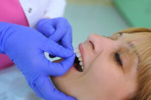

[Veneers](/dental-veneers/) are a popular cosmetic dental solution for achieving a brighter, more uniform smile. Whether made from porcelain or composite resin, they can correct discoloration, chips, gaps, and uneven teeth. While veneers are generally safe and effective, it’s important to understand that, like any dental procedure, they can come with some side effects.

Here are 4 potential side effects to consider before moving forward with treatment.

## 1. Tooth Sensitivity

One of the most common side effects after getting veneers is increased tooth sensitivity. This often occurs because a thin layer of enamel is removed during the preparation process, especially with porcelain veneers.

Without that protective layer, your teeth may temporarily become more sensitive to hot or cold foods and drinks. For most patients, this sensitivity fades within a few days to a few weeks. Furthermore, removing the enamel does not permanently harm the teeth.

Using toothpaste designed for sensitive teeth and avoiding extreme temperatures can help manage discomfort during the adjustment period.

## 2. Irreversibility of the Procedure

Veneers—particularly porcelain ones—require permanent changes to your natural teeth. Because enamel does not grow back, the process is considered irreversible.

Once you have veneers, you’ll always need some type of restoration on those teeth moving forward. If a veneer becomes damaged or worn over time, it will need to be repaired or replaced.

This long-term commitment is an important factor to consider before choosing veneers.

## 3. Risk of Damage or Wear

Although veneers are durable, they’re not indestructible. Habits like biting hard objects, chewing ice, or grinding your teeth can lead to chips, cracks, or wear over time.

Teeth grinding, also known as bruxism, can put extra pressure on veneers and shorten their lifespan. In some cases, your dentist may recommend wearing a nightguard to protect your teeth while you sleep.

Proper care and avoiding harmful habits can significantly reduce the risk of damage.

## 4. Potential for Gum Irritation

After veneers are placed, some patients may experience mild gum irritation or inflammation. This is usually temporary and may occur as your gums adjust to the new restorations.

However, if veneers are not properly fitted or if oral hygiene is not maintained, irritation can persist and lead to issues like gingivitis.

Keeping up with good oral hygiene—brushing, flossing, and regular dental visits—can help prevent complications and keep your gums healthy.

Veneers can dramatically enhance your smile, but it’s important to be aware of the potential side effects. From temporary sensitivity to long-term maintenance, understanding what to expect can help you make an informed decision.

## About the Practice

How would you like to remedy several cosmetic imperfections in your smile at once? We can do it with veneer treatment here at Toothbar in Austin. Led by [Drs. Barclay and Jacobsen](/who-we-are/#doctors), we provide personalized care to ensure your veneers look and feel natural, giving you the confidence to smile freely. Book [online](/contact/) or call us at (512) 607-4268.
