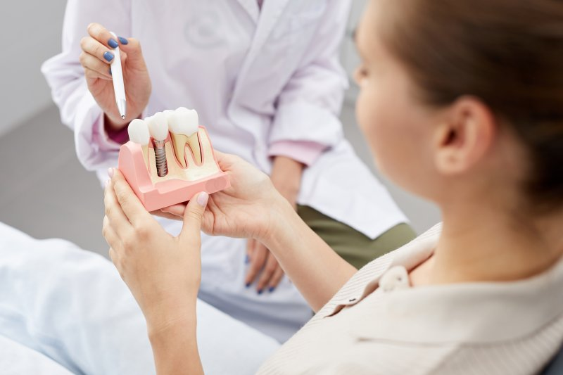

If you have been missing teeth, then you may know how they can impact your life every day. You might have trouble comfortably eating or showing off your smile, but there are several tooth replacements that can give you a full grin once again. [Dental implants](/dental-implants/) are often the gold standard since they are natural-looking and reliable, but you will have to be a good candidate first. Here are three qualities that can help you be eligible for this service.

## 1.) You Have Great Oral Health

As you may imagine, dental implants are placed in your mouth, so your oral health will have to be in great shape. Any problems can get in the way of a successful treatment, so decay, infection, and the like will need to be taken care of.

This is especially true for [periodontal disease](/periodontal-scaling-root-planing/), as this condition can affect your gum and bone tissue, which can lead to failure or wobbly results. By simply brushing, flossing, and having routine checkups, you can help make sure you don’t have anything to worry about.

## 2.) Your Overall Health Is in Good Standing

It might seem odd, but your dentist will want to know more about your overall health, lifestyle, and habits. If you have any systemic conditions, such as cardiovascular disease or diabetes, then they can slow down your recovery. When you can't heal properly, you open the risk of infection and failure. The good news is that keeping these issues managed can help you avoid complications, but your provider can give you further advice on them as well.

Whether you smoke will also need to be brought up, as tobacco can cause periodontal disease and have an impact on your immune system. Over time, your jawbone may also become weaker, making your results unstable. You should consider quitting entirely or talking to your dentist about what you can do.

## 3.) Your Jawbone Is Dense Enough to Support Dental Implants

Based on everything above, you might be able to guess that your jaw will also need to be strong and sturdy. That’s because dental implant posts are placed into the bone. The tissue will need to grow around them to become a permanent part of your oral anatomy; that way, you have the strong bite this replacement is known for.

If you have been missing teeth for several years, then your jawbone may have started to be reabsorbed by your body. This is a natural process to allow the minerals to be used elsewhere, but you may need a [bone graft](/bone-grafting/) to reinforce those areas. So, they’ll be better able to support implants.

At the end of the day, the only way to know if you’re a good candidate for this treatment is by talking to your dentist. They will take a look at everything above and more to ensure you have a successful and easy journey toward a full set of teeth.

## About the Practice

At [Chapel Hill Dental Arts](/our-practice/), you benefit from a team of skilled dentists who look after you and your oral health. We are dedicated to helping the Red Bank community get the restored grins they deserve with reliable treatments like dental implants. With multiple specialists on staff, we can give you the one-stop shop toward a brand new smile you feel confident in. If you want to see your candidacy for this service, [schedule an appointment](https://s.hsone.io/MdxGf8ajzH) or call our office at **(732) 365-0123.**
