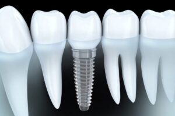

In modern dentistry, implants have emerged as a game-changing solution for individuals seeking to restore both the function and aesthetics of their smiles. As an increasingly popular choice, it offers a range of advantages over traditional tooth replacement options like dentures and bridges. This article delves into the various benefits of implants, from their ability to restore function and aesthetics to their long-term durability, easy maintenance, improved oral health, and cost-effectiveness.

Dental implant have grown in popularity in recent years, and for good reason. These remarkable dental fixtures not only replicate the natural look and feel of teeth but also provide various functional and aesthetic benefits. They are titanium posts surgically inserted into the jawbone, serving as sturdy anchors for artificial teeth. Their ability to mimic the function and aesthetics of natural teeth makes them an attractive choice for those seeking a complete smile makeover.

## Restoring Function

**Improved Chewing and Biting Ability**

One of the most noticeable advantages of implants is the significant improvement in chewing and biting ability. Unlike removable dentures that can slip or cause discomfort, implants are securely anchored to the jawbone. This stability allows individuals to comfortably and confidently enjoy their favorite foods without fearing embarrassing mishaps.

**Maintaining Facial Structure and Preventing Bone Loss**

Implants play a crucial role in maintaining facial structure. When teeth are lost, the jawbone can deteriorate over time, leading to a sunken facial appearance. Implants stimulate the bone, preventing this deterioration and preserving the natural contours of the face. This not only enhances aesthetics but also contributes to better overall facial health.

**Enhanced Speech and Pronunciation**

Tooth loss can affect speech and pronunciation, leading to difficulty articulating words. Dental implants provide a stable and natural base for the replacement teeth, helping individuals regain clear and accurate speech patterns and boosting their confidence in social interactions.

## Restoring Aesthetics

**Natural-Looking and Attractive Smile**

Implants are designed to look and feel like natural teeth. They blend seamlessly with the remaining natural teeth, providing a harmonious and aesthetically pleasing smile. Unlike removable options, implants do not have visible attachments, giving you the confidence to smile freely.

**Boosting Self-Confidence and Self-Esteem**

The restoration of a beautiful and natural smile through implants can have a profound impact on an individual's self-confidence and self-esteem. The ability to smile without hesitation or worry about the appearance of artificial teeth empowers people to engage in social and professional settings with increased self-assurance.

## Long-Term Durability

**Superior Durability Compared to Other Tooth Replacement Options**

Dental Implants are renowned for their durability. Unlike dentures and bridges, which may need frequent replacements or repairs, implants are built to last a lifetime. With proper care and maintenance, they can withstand the test of time, providing a cost-effective solution in the long run.

**Reduced Risk of Damage or Decay**

Implants do not decay like natural teeth, and they are highly resistant to damage. This durability eliminates the constant worry of cavities or tooth fractures, offering peace of mind to individuals who opt for this tooth replacement solution.

## Easy Maintenance

**Simple Oral Hygiene Routine**

Maintaining implants is as straightforward as caring for natural teeth. Regular brushing, flossing, and routine dental check-ups are all required to keep your implants in optimal condition. There are no complex cleaning techniques or specialized products to worry about.

**No Special Cleaning Techniques or Products Required**

Unlike dentures that may need soaking or adhesives, implants do not require special cleaning techniques or products. This simplicity adds to the convenience and ease of implant maintenance.

## Improved Oral Health

**Preserving Neighboring Teeth by Avoiding the Need for Dental Bridges**

One of the lesser-known benefits of implants is their ability to preserve the health of neighboring teeth. Traditional dental bridges often require the modification of adjacent healthy teeth to support the bridge. [Dental implants](/dental-services/restorative-dentistry/dental-implants/), on the other hand, stand independently, preserving the integrity of neighboring teeth.

**Preventing Shifting of Teeth and Improving Overall Oral Health**

Tooth loss can lead to the shifting of neighboring teeth, causing misalignment and bite issues. Implants prevent this shifting, promoting better overall [oral health](https://www.who.int/health-topics/oral-health#tab=tab_1) and maintaining proper dental alignment.

## Cost-Effectiveness Of Dental Implant

**Long-Lasting Solution That Eliminates the Need for Frequent Replacements**

While the initial cost of dental implants may be higher than other tooth replacement options, their long-term durability and minimal maintenance requirements make them a cost-effective choice. They eliminate the need for frequent replacements and associated expenses.

**Potentially Lower Overall Costs Compared to Alternative Treatments**

When considering the cumulative costs of maintenance, repairs, and replacements for dentures or bridges over a lifetime, implants may be a more economical choice in the long run.

Dental implants offer a multifaceted solution to the challenges posed by tooth loss. They not only restore function and aesthetics but also provide long-term durability, easy maintenance, improved oral health, and cost-effectiveness. If you're considering tooth replacement options, implants are a compelling choice that can positively transform your life and restore your smile. To explore the possibility of implants for your unique needs, consult a professional who can provide personalized advice and guidance on your journey to a confident, functional, and radiant smile. Choose to invest in your oral health and well-being today with implants.
