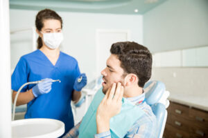

## 

## **Finding the Right Emergency Dentist: What to Consider**

Whether it's a sudden toothache or a broken crown, finding the right dentist is crucial to getting the prompt and professional care you need. But with so many options out there, how do you choose? Don't worry - we've got you covered! This blog post will walk you through what to consider when selecting an Dentist. So sit back, relax (if you can), and let us guide you toward finding the perfect dental superhero who will swoop in to save your smile!

## Several factors should guide your decision when selecting an dentist.

1. Location and accessibility are paramount, ensuring that help is conveniently nearby during emergencies.
2. Availability and rapid response times are crucial to address urgent dental issues promptly.
3. Verify that the dentist offers the specific services you may need, from pain relief to treatments.
4. Checking reviews and recommendations provides valuable insights into their quality of care.
5. Consider the cost and insurance coverage, ensuring pricing and payment options transparency.
6. Verify the dentist's qualifications and experience, and assess your comfort level and communication with them. Choosing the right dentist involves a thoughtful evaluation of these key considerations.

## **1. Location and Accessibility**

Location and accessibility are key factors when choosing an emergency dentist in Littleton. You want to find a dental clinic that is conveniently located, making it easy for you or your loved ones to access during an urgent situation. A dental office nearby can provide peace of mind, knowing that help is just minutes away.
 Consider the proximity of the dentist to your home, workplace, or school. Is it easily accessible from major roadways? Are there public transportation options available nearby? These are important questions to ask yourself as they will determine how quickly you can reach the dental clinic in an emergency.

## **2.****Availability and Response Time**

Look for an dentist who offers extended hours or even 24/7 availability. This means they are ready to handle your dental emergency no matter what time it occurs. A dentist with flexible scheduling options can ensure that you receive prompt treatment without waiting too long.
 In addition to availability, response time is another crucial aspect. You want a dentist who can respond quickly to your dental emergency and provide immediate care. Ask about their average response time during emergencies and how they prioritize urgent cases.

## **3. Services Offered by the Emergency Dentist**

When you need an dentist, one of the most important factors to consider is the range of services offered. Not all dental emergencies are created equal, so choosing a dentist who can address your specific needs is crucial.
 First, ensure that the dentist offers immediate treatment for severe tooth pain or injuries. This may include procedures such as root canals, extractions, or repairs to broken teeth. Additionally, they should be equipped to handle common issues like abscesses or infections.
 In addition to urgent care services, choosing an dentist who provides preventative and restorative treatments is also beneficial. If your dental emergency requires ongoing care or follow-up procedures, you won't need to seek another provider.
 Furthermore, look for a dentist who offers a comprehensive approach to oral health. Services like cleanings and check-ups can help prevent future emergencies by addressing potential problems before they become major issues.

## **4. Reviews and Recommendations from Others**

When finding the right dentist, one of the key factors to consider is reviews and recommendations from others. Hearing about other people's experiences can give you valuable insights into the quality of care and service a particular dentist provides.
 Start by asking your family, friends, and colleagues if they have any recommendations for emergency dentists in Littleton. These personal referrals are often trustworthy as they come from people with firsthand experience with a specific dentist.
 Remember that while online reviews can provide useful information, they should be taken carefully. Some negative reviews may be outliers or reflect individual preferences rather than objective quality care assessments.

## **5. Cost and Insurance Coverage**

When choosing an [emergency dentist in Littleton](/dental-services/emergency-dentistry/), one important factor is cost and insurance coverage. Dental emergencies can happen unexpectedly, and they often come with unexpected expenses. Therefore, it's essential to find a dentist who provides quality care and offers fair pricing options.
 Inquire about insurance coverage when selecting an dentist. Find out if they accept your dental insurance and whether they will work with you on payment plans or financing options if needed. Choosing a dentist who understands your financial situation and is willing to accommodate your needs as best as possible is important.

## **6.****Qualifications and Experience of the Dentist**

When choosing an emergency dentist, one of the most important factors to consider is the dentist's qualifications and experience. You want someone who has the necessary training and expertise to handle any dental emergency that may arise.
 Ensuring that the dentist you choose is licensed and certified is crucial. This guarantees they have completed all the required education and training programs to practice dentistry safely and effectively. Knowing that they adhere to strict professional standards also gives you peace of mind.
 Additionally, consider how long the dentist has been practicing in the field. Experience plays a significant role in handling emergencies because it allows dentists to develop their skills over time. An experienced dentist will be more familiar with various dental conditions and will know how best to treat them.
 Furthermore, look for any additional certifications or specializations a dentist may have. For example, some dentists may specialize in [oral surgery](https://www.ncbi.nlm.nih.gov/pmc/articles/PMC3814657/) or endodontics, which can be beneficial if your emergency requires specific procedures.

## **7. Communication and Comfort Level with the Dentist**

Effective communication is vital for a positive dental experience. It's important to find a dentist who listens attentively, explains procedures clearly, and addresses any concerns or questions you may have. A good dentist will take the time to understand your needs and provide personalized care.
 Comfort during dental visits is essential, especially during emergencies when experiencing pain or anxiety. Look for a dentist who creates a welcoming environment and offers amenities like comfortable seating, soothing music, or even sedation options if needed. A compassionate and empathetic dentist can help alleviate your fears and make the process more comfortable.

By considering these factors, you can make an informed choice that not only safeguards your dental health but also provides peace of mind in emergencies. It's essential to prioritize proximity and accessibility to ensure quick access during urgent situations. Moreover, the comprehensiveness of services offered and positive patient experiences is crucial in determining the quality of care. Cost considerations and insurance compatibility play a significant role in managing expenses. Dentist qualifications and experience are paramount in ensuring effective treatment. Finally, personal comfort and effective communication with your chosen dentist establish a foundation for trust and a successful patient-dentist relationship. In sum, by carefully evaluating these factors, you can make a well-informed decision in selecting the right dentist in Littleton for your needs.
