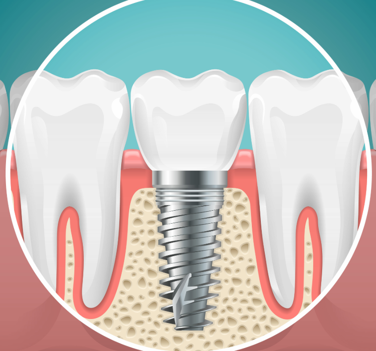

[Dental implants](/dental-implants/) may feel like a modern innovation, but their history stretches back thousands of years. What began as early attempts to replace missing teeth using carved materials has evolved into today’s highly advanced titanium implant systems. Understanding this journey helps explain why modern implants are so reliable, durable, and widely used.

## Early Attempts at Replacing Teeth

The earliest versions of dental implants were far from what we know today. Ancient civilizations experimented with materials such as bamboo, shells, ivory, and even precious metals to replace missing teeth. Archaeological evidence shows that cultures in China and Egypt attempted to stabilize these materials in the jaw, though success was limited and often temporary due to the body rejecting foreign objects.

While these early efforts were creative, they lacked the biological compatibility needed for long-term success. The main challenge was that the body would not naturally bond with these materials, leading to failure over time.

## Early 20th Century Breakthroughs

By the early 1900s, dentists and researchers began experimenting with more advanced materials like gold, platinum, and various metal alloys. Some designs showed partial success, but most still failed due to poor integration with bone tissue.

A key step forward came in the 1940s when researchers observed that titanium had a unique ability to come into close contact with bone without being rejected. This discovery laid the groundwork for future implant development and shifted attention toward biocompatible metals. ([Wikipedia](https://en.wikipedia.org/wiki/History_of_dental_treatments?utm_source=chatgpt.com))

## The Discovery That Changed Everything: Titanium and Osseointegration

The biggest breakthrough in dental implant history came in the 1950s and 1960s with Swedish researcher Dr. Per-Ingvar Brånemark. While studying bone healing, he discovered that titanium could actually fuse with bone in a process later named osseointegration. This meant the implant could become a stable, long-lasting part of the jaw rather than a foreign object the body rejects.

In 1965, Brånemark placed the first successful titanium dental implant in a human patient. That milestone marked the beginning of modern implant dentistry and completely changed how missing teeth could be replaced.

## Advancements in Modern Dental Implant Design

Once titanium implants proved successful, innovation accelerated rapidly. Over the following decades, researchers refined implant shape, surface texture, and placement techniques to improve healing and stability.

Modern implants are designed with specialized surfaces that encourage faster bone growth and stronger integration. Improvements in imaging technology, surgical precision, and digital planning have also made the process more predictable and comfortable for patients than ever before.

Today’s implants are not just replacements for missing teeth—they function much like natural tooth roots, providing stability for crowns, bridges, and even full-mouth restorations.

## How These Advances Benefit Patients Today

Because of decades of innovation, dental implants now offer high success rates, long-term durability, and a natural appearance. What once required experimental materials and uncertain outcomes has become a routine, highly refined procedure that can restore both function and confidence.

Modern implant dentistry continues to evolve, but its foundation remains the same breakthrough discovery: titanium’s ability to integrate with bone and create a stable, lasting solution. That evolution is what makes dental implants one of the most trusted tooth replacement options available today.

## About the Practice

Chapel Hill Dental Arts provides comprehensive restorative dentistry with a focus on advanced solutions like dental implants to help patients rebuild function, health, and confidence. [Our dentists](/our-practice/) use modern diagnostic tools and treatment planning to ensure each implant case is carefully customized for long-term success. With an emphasis on comfort, precision, and patient education, we are committed to delivering natural-looking, durable results that support overall oral health and quality of life.

Call us at [(732) 365-0123](https://www.google.com/search?gs_ssp=eJzj4tZP1zcsTzEurzJONmC0UjWosLBMNjI2TLQwMjRNSzGyTLEyqEg0MEhKM0hONUtLS04zMU32Ek_OSCxIzVHIyMzJUUhJzStJzFFILCopBgBsPxgQ&q=chapel+hill+dental+arts&rlz=1C1HKFL_enUS1203US1203&oq=chapel+hill+dental+art&gs_lcrp=EgZjaHJvbWUqDQgBEC4YrwEYxwEYgAQyCggAEAAY4wIYgAQyDQgBEC4YrwEYxwEYgAQyBggCEEUYOTIHCAMQABiABDIHCAQQABiABDIICAUQABgWGB4yBggGEEUYPDIGCAcQRRg80gEINzExMWowajmoAgawAgHxBRjF4IGySPBb&sourceid=chrome&ie=UTF-8) or [schedule your appointment online](/contact/).
