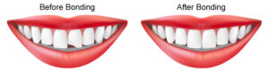

If you are suffering from a cracked tooth, you may be wondering what can be done to repair it. Fortunately, there are a few effective tips for cracked tooth repair from experts that can help you get your smile back in no time. In this blog, we will discuss the various treatment options available for repairing a cracked tooth and provide tips to make sure that you get the best possible outcome from your treatment.

Cracked teeth can be a difficult problem to deal with and they can cause pain and discomfort, and even put you at risk for infection. Fortunately, there are options available to repair a cracked tooth and restore it to its former glory. In this blog, we will cover some of the most effective tips for cracked tooth repair from experts.

https://www.youtube.com/watch?v=oZELwVQpiIk

Source - [Smile Influencers](https://www.youtube.com/@SmileInfluencers)

## Removable Dental Appliances

One of the most popular methods for repairing a cracked tooth is to use a removable dental appliance, such as a crown or veneer. Crowns and veneers can be custom-fitted to the shape of your tooth, making them an effective way to repair a cracked tooth. In addition, they can be used to restore the color and shape of your tooth, making them a great option for cosmetic purposes as well.

### Tips for Choosing a Removable Dental Appliance

When choosing a removable dental appliance to repair your cracked tooth, it is important to consider a few key factors. First, you should make sure that the appliance is the right size and shape for your tooth. Second, you should make sure that the appliance is made from a durable material that can withstand daily wear and tear. Lastly, you should make sure that the appliance is comfortable to wear and doesn’t cause pain or discomfort.

### Advantages of Removable Dental Appliances

Removable dental appliances are an effective and affordable way to repair a cracked tooth. They can be used to restore the shape, color, and strength of a cracked tooth, making them an ideal choice for cosmetic purposes. In addition, they are comfortable to wear and easy to remove.

## Dental Bonding

Another effective method for repairing a cracked tooth is dental bonding. This procedure involves applying a resin material to the surface of the tooth, which is then hardened and polished. The result is a strong, durable bond that can help to restore the original shape and strength of the tooth.

### Tips for Choosing Dental Bonding

When considering dental bonding to repair a **[cracked tooth](https://en.wikipedia.org/wiki/Cracked_tooth_syndrome)**, it is important to choose a professional who has experience with the procedure. It is also important to make sure that the resin material being used is strong and durable and can withstand daily use. Lastly, you should make sure that the dentist is using proper techniques to ensure a successful outcome.

### Advantages of Dental Bonding

Dental bonding is a quick and effective way to repair a cracked tooth. It is also a cost-effective option, as it can be done in just one visit to the dentist. In addition, dental bonding has a natural-looking finish, making it a great choice for cosmetic purposes.

## Frequently Asked Questions

Q: What is the best treatment option for repairing a cracked tooth?

A: The best treatment option for repairing a cracked tooth will depend on the severity of the crack. Removable dental appliances and dental bonding are both popular options for treating cracked teeth, but it is important to consider all of your options before deciding on the best course of action.

Q: Are there any risks associated with cracked tooth repair?

A: Yes, there are some risks associated with cracked tooth repair. These risks include sensitivity or pain in the repaired area, as well as damage to surrounding teeth. It is important to speak to your dentist about any potential risks before beginning treatment.

Q: How much does cracked tooth repair cost?

A: The cost of cracked tooth repair will depend on the treatment option chosen and the severity of the crack. Removable dental appliances and dental bonding are typically affordable options, but it is important to speak to your dentist about the cost before beginning treatment.

## Conclusion

Repairing a cracked tooth can be complicated, but luckily there are a few effective tips for **[cracked tooth repair](/dental-services/general-dentistry/cracked-tooth-repair/)** from experts that can help you get your smile back in no time. With the right treatment option and the right care, you can restore your tooth to its former glory.
