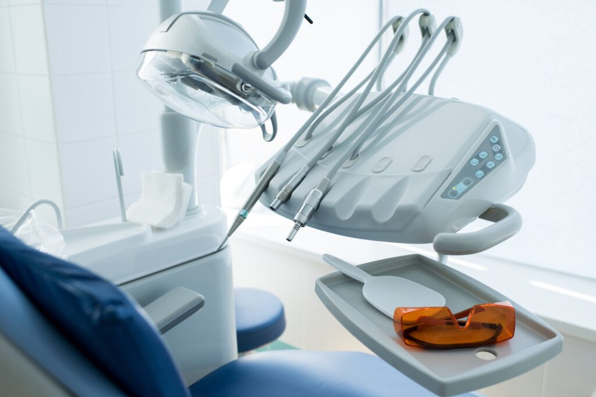

Choosing the right dentist is one of the most important decisions you can make for your health - and your confidence. In a place like Red Bank, NJ, where options abound, it can feel overwhelming to know which dental office is the best fit for your needs. Whether you’re [new to the area](/new-patients/), unhappy with your current provider, or simply looking for a change, here’s a guide to help you choose the best dentist in Red Bank with confidence.

## 1. Look for Comprehensive Care Under One Roof

One of the best ways to simplify your dental care is by choosing a practice that offers a wide range of services. From [preventive cleanings](/dental-exams-cleanings/) and cosmetic dentistry to [root canals](/root-canal-therapy/) and [dental implants](/dental-implants/), having a single dental home for all your needs saves time, builds trust, and ensures continuity of care.

At [Chapel Hill Dental Arts](/our-practice/), patients benefit from a full spectrum of care in one place. The practice is led by:

- Dr. Asim Zaidi, known for his decades of experience and advanced training in Straumann implants and All-on-4 restorations.
- Dr. Kristen Blumberger, an endodontist focused on gentle, anxiety-free root canal therapy.
- Dr. Steven Reff, who specializes in dental implants and Teeth In A Day solutions.

This multidisciplinary team ensures you have access to expert-level treatment - without needing to visit multiple offices.

## 2. Consider Experience and Advanced Training

When it comes to your oral health, experience matters. You want to know your dentist has seen a wide variety of cases and stays up to date on the latest advances in dentistry.

At Chapel Hill Dental Arts, Dr. Zaidi brings over 20 years of experience and has been recognized as a Gold Provider for Straumann Implants. He is also active in continuing education through institutions like Spear Education. Dr. Blumberger completed an advanced endodontic residency and brings a gentle, compassionate approach to even the most complex root canal cases. Dr. Reff brings his specialized training and expertise in full-arch restorations, helping patients transform their smiles in a single visit.

## 3. Evaluate Technology and Comfort

A modern dental office isn’t just about sleek décor - it’s about using technology that improves outcomes and enhances your experience.

Chapel Hill Dental Arts has invested in advanced dental technology to provide precise diagnostics and minimally invasive treatment. From digital imaging to state-of-the-art implant placement, every tool is chosen to deliver better results with less discomfort. The office is also designed with patient comfort in mind, creating a welcoming, relaxing space from the waiting area to the treatment rooms.

## 4. Read Reviews and Ask Around

One of the best ways to gauge a dentist’s reputation is by hearing directly from other patients. Google reviews, social media testimonials, and even word-of-mouth recommendations can help you understand what it’s really like to be a patient at a particular practice. [Click here](https://www.google.com/search?sca_esv=137b759269c363f4&rlz=1C1VDKB_enUS1041US1041&si=AMgyJEuzsz2NflaaWzrzdpjxXXRaJ2hfdMsbe_mSWso6src8s68Qaw9QZtzgQGaq9CncdTKueF8b0uVv_htgj74ptDzOgZ48hQPo958CLRuZY_yXbcM0-5wg90MVECTDhz8sJU864OcMmDmvunFIDVFg01gT6OOpRQ%3D%3D&q=Chapel+Hill+Dental+Arts+Reviews&sa=X&ved=2ahUKEwiZ5oDj362OAxWolYkEHVsSOBgQ0bkNegQIMxAE&biw=1707&bih=772&dpr=1.13) to read some of our over 1,000 Google reviews.

Chapel Hill Dental Arts has earned praise from patients for its knowledgeable team, excellent communication, and ability to make even the most anxious visitors feel at ease. Many families in Red Bank and Middletown trust them for lifelong care.

## 5. Prioritize Personalized, Compassionate Care

Dental care should never feel one-size-fits-all. The best dentist takes time to listen to your concerns, explain your options, and tailor your treatment plan to your goals, health, and budget.

At Chapel Hill Dental Arts, patients receive truly personalized care. Whether you’re seeking cosmetic enhancements, full-mouth rehabilitation, or routine cleanings for the whole family, the team treats you like a person - not just a patient. They believe dentistry should be accessible, honest, and centered around your comfort.

## 6. Location and Convenience Matter

Finally, convenience plays a big role in sticking to regular dental visits. Look for a dental office that’s close to home or work, with flexible scheduling options that fit your lifestyle.

Chapel Hill Dental Arts is conveniently located on NJ-35 in Red Bank, NJ, and also serves Middletown and surrounding areas. With a knowledgeable team, modern facility, and a wide range of services, it’s a smart choice for families and individuals who want quality care close to home.

## Ready to Find Your Forever Dentist?

If you’re searching for the best dentist in Red Bank, NJ, we invite you to experience the difference at Chapel Hill Dental Arts. With a patient-first approach, advanced technology, and expert doctors you can trust, we’re here to help you achieve your healthiest, most confident smile.

[Contact us](https://s.hsone.io/MdxGf8ajzH) today to schedule your first visit!
