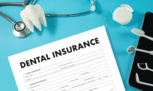

The clock is ticking, and if you haven’t been keeping a close eye on your dental insurance benefits, you might be in for a rude awakening. The term “use it or lose it” is more than just a catchphrase; it’s a reality when it comes to your dental insurance. With the end of the year fast approaching, now is the perfect time to take charge and plan your dental care wisely to ensure you maximize your savings.

## Why Planning Your Dental Care Matters?

As the year winds down, many of us scramble to use up those benefits before they disappear. If you’ve been putting off dental appointments or treatments, you’re not alone. But here’s why you should reconsider delaying any longer:

1. **Don’t Let Your Benefits Expire** Dental insurance benefits typically operate on a calendar year basis. This means any unused benefits won’t roll over to the next year. So if you’ve been sitting on a chunk of benefits, you risk losing them entirely if you don’t act soon.
2. **Beat the Year-End Rush** Toward the end of the year, dental offices often experience a surge in appointment requests. Booking early ensures you get a spot at a convenient time and avoids the stress of last-minute scheduling.
3. **Avoid Future Costs** Taking care of minor dental issues now can prevent them from becoming major problems later. Addressing small issues early can save you from needing more expensive treatments down the line.
4. **Plan for Major Procedures** If you’re considering significant dental work, such as implants or crowns, starting the process before the year ends allows you to utilize your benefits fully before they reset.

## How to Maximize Your Dental Benefits?

To get the most out of your dental insurance, here are some smart tips:

1. **Schedule Routine Cleanings and Exams** Most insurance plans cover two cleanings and exams per year. If you’ve only had one, book your second visit before the year is out to fully utilize your benefits.
2. **Address Minor Issues Now** Got a small cavity or need a minor restoration? Now’s the time to get those taken care of. Small issues can escalate quickly, leading to more complex and costly treatments.
3. **Take Advantage of Preventive Care** Many plans cover preventive treatments like sealants and fluoride applications. These services can help you avoid future problems and keep your dental health in check.
4. **Plan Major Treatments Strategically** If you need extensive dental work, consider starting your treatment before the end of the year. This way, you can make the most of your benefits and possibly complete the procedure while they’re still active.

## The Risks of Delaying Dental Care

Putting off dental care can have serious consequences:

**Worsening Cavities:**If left untreated, a tiny cavity can get worse and become a bigger problem. Maintaining problem manageability requires early intervention.

1. **Advancing Gum Disease:**Treating gum disease in its early stages is less complicated and expensive. Ignoring it can result in more serious issues, such as losing your teeth.
2. **Increased Risk of Tooth Loss:**Routine cleanings can avoid plaque accumulation, which, over time, can erode teeth. However, missing appointments may have long-term consequences.
3. **Higher Future Expenses:** In general, treating dental disorders early on is less expensive than treating more complex problems later on. You can save money later on if you make an investment in your dental care today.

## Act Now to Secure Your Savings!

At Columbine Creek Dentistry, we’re here to help you make the most of your dental benefits before the year ends. Don’t let your hard-earned benefits go to waste. Schedule your appointment today to ensure your dental health is in top shape and your savings are maximized.

Contact us now to book your visit and take full [advantage of your dental insurance](/payment-options/dental-insurance/). Time is running out—act now to protect your smile and your wallet!
