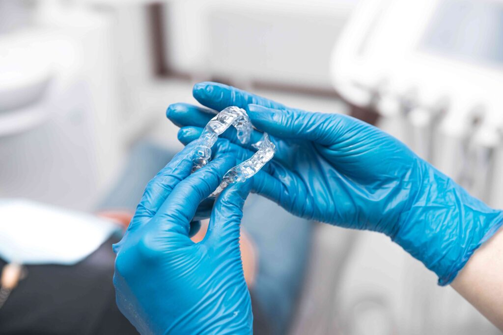

If you have alignment issues, Invisalign is a great way to achieve a straighter smile without a mouthful of metal brackets and wires. [Invisalign](/invisalign/) uses a series of clear aligners to slowly shift the teeth into their rightful locations. One of the incredible benefits of Invisalign is that the aligners are nearly invisible, so others cannot easily detect them. But what if you already had braces? Can you still get Invisalign? Continue reading to learn more!

## Why Did My Teeth Shift After Braces?

Braces use metal brackets and wires to slowly shift the teeth into their location. However, there are a variety of reasons why they can shift back after completing treatment. This is why it’s so important that you continue to wear your retainer following your orthodontic treatment. This will prevent the teeth from shifting back to their old places like they naturally want to. The good news is that if your teeth have moved around since you got your braces off, Invisalign is likely an idea solution to achieve your goals!

## How Does Invisalign Work Following Traditional Braces?

Invisalign uses a series of customized clear aligners to gradually move your teeth into alignment. Since your teeth have previously been straightened with braces, your treatment probably won’t take as long as it did during your first orthodontic treatment. The great thing about Invisalign is that you don’t need to worry about breaking any brackets or wires. You don’t need to worry about any eating restrictions either. You simply take out your aligners for eating and cleaning your smile. It’s as easy as that!

## How Do I Get Started?

If you are interested in beginning Invisalign treatment, give your dentist a call to schedule your consultation. During this appointment, they will examine your teeth and jaw to determine whether or not Invisalign is the right solution for you. If so, impressions will be taken so your custom aligners can be made. Once you receive your aligners, you will need to wear them for 20-22 hours each day for them to effectively move your teeth. Your dentist will provide you with specific instructions on when to switch to your next set of aligners as well as the best cleaning methods to keep your smile fresh.

If your teeth don’t look how they did when you first completed orthodontic treatment, Invisalign may be the solution for you. Schedule a consultation with your dentist to get started.

## About the Practice

At Toothbar, we have a team of skilled dentists working together to treat patients in the Austin community. With their combined experience and expertise, patients can get pretty much anything they need under one roof. To learn more about Invisalign or to schedule a consultation, visit our [website](/contact/) or call (512) 607-4268.
