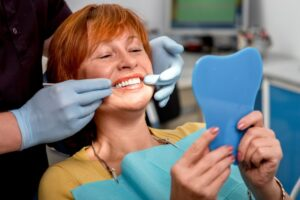

For people struggling with missing or failing teeth, the idea of leaving the dental office with a new smile in just one appointment can be incredibly appealing. "Teeth in a Day" is a term commonly used to describe implant procedures that allow patients to receive [dental implants](/dental-implants/) and a temporary set of teeth on the same day as surgery.

While this treatment can offer life-changing benefits, it's important to understand both the advantages and potential drawbacks before deciding whether it's right for you.

## What is Teeth in a Day?

Traditional dental implant treatment often involves several months of healing between implant placement and the attachment of the final restoration. With Teeth in a Day, dental implants are placed and a temporary prosthetic is secured to the implants during the same appointment.

Patients leave the office with a functional, attractive smile while the implants heal and integrate with the jawbone. Once healing is complete, a permanent restoration is created and attached.

## Pro: Immediate Smile Restoration

One of the biggest advantages of Teeth in a Day is that patients do not have to spend months without teeth or rely on removable dentures during the healing process.

This immediate restoration can provide:

- Improved appearance.
- Increased confidence.
- Better speech.
- Enhanced social comfort.

Many patients appreciate being able to smile and interact with others right away.

## Pro: Improved Function

Temporary teeth attached to implants often provide greater stability than traditional removable dentures. This can make it easier to eat and speak during the healing period.

Although some dietary restrictions are typically required while the implants heal, many patients enjoy significantly improved function compared to living with missing teeth.

## Con: Not Everyone is a Candidate

Teeth in a Day is not suitable for every patient. Successful treatment depends on factors such as:

- Adequate bone density.
- Healthy gums.
- Good overall health.
- Proper implant stability at placement.

Some patients may require bone grafting or additional procedures before implants can be placed safely.

A thorough evaluation is necessary to determine eligibility.

## Con: Healing Still Takes Time

While patients receive teeth immediately, the implants still require several months to fully integrate with the jawbone.

During this period, patients must follow their dentist's instructions carefully and often adhere to a modified diet to avoid placing excessive pressure on the implants.

It's important to remember that the same-day teeth are typically temporary, not the final restoration.

Teeth in a Day offers the exciting possibility of restoring a smile quickly while improving confidence and function. However, it is not the best solution for everyone, and proper healing remains essential for long-term success. If you're considering dental implants, a consultation with your dentist can help determine whether Teeth in a Day is an appropriate option based on your oral health, treatment goals, and individual needs.

## About the Practice

How would you like to take back not just the aesthetic appeal of your smile, but your overall health and functionality? Dental implants here at Chapel Hill Dental Arts can help you do just that! Our restorations not only replace the visible portion of the tooth, but the root as well, giving you true stability just like the feeling of a natural tooth. And wouldn’t you like to proudly smile in photos again? Book an appointment [online](/contact/) with us or by calling our Red Bank office at (732) 365-0123.
