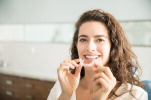

Invisalign aligners have revolutionized the world of orthodontics by providing a discreet and effective way to straighten teeth. Unlike traditional braces with metal wires and brackets, Aligners are nearly invisible, making them a popular choice for those seeking a more inconspicuous path to a beautifully aligned smile. But have you ever wondered how these aligners work? This blog will delve into the science behind Invisalign and uncover the secrets to its success.

## How Does Invisalign Work

At the heart of Invisalign's success is its innovative use of thermoplastic material and the concept of gradual force and controlled movement. Let's break down these key components.

**Explanation of the Thermoplastic Material**

Invisalign aligners are made from a special type of medical-grade thermoplastic material. This material is safe for oral use and highly flexible when exposed to heat. The key to Invisalign's effectiveness lies in the ability of this material to respond to specific temperatures, allowing for customization and controlled movement of your teeth.

**The Treatment Process**

Invisalign treatment begins with an initial consultation and 3D imaging of your teeth. A digital 3D model of your mouth is created, enabling your orthodontist to map out the precise movements your teeth need to make to achieve the desired alignment.

**Customized Aligner Fitting and Treatment Timeline**

Based on the 3D model, a series of customized aligners are created, each slightly different from the previous one. You'll wear each set of aligners for about two weeks, gradually moving your teeth into their ideal positions. As you switch to new aligners, the thermoplastic material applies gentle but consistent pressure on your teeth, encouraging them to move in the desired direction. This controlled force is key to the success of Invisalign, as it avoids sudden and uncomfortable adjustments often associated with traditional braces.

## Benefits of Clear Aligners

The science behind Invisalign aligners comes with a range of benefits:

**Nearly Invisible:** As the name suggests, aligners are barely noticeable. This discreet nature makes them popular among adults and teens who may be self-conscious about wearing traditional braces.

**Comfort and Convenience:** Aligners are smooth, without sharp edges or wires, making them more comfortable to wear than traditional braces. They can also be removed for eating, brushing, and flossing, providing convenience that braces can't match.

## Comparison to Traditional Braces

While traditional braces have been a successful orthodontic treatment for decades, the [Invisalign Dentist in Littleton](/dental-services/cosmetic-dentistry/invisalign/)offers several advantages:

**Aesthetics:**Aligners are virtually invisible, offering a cosmetic advantage that traditional braces can't match.

**Comfort:**The absence of metal components in aligners makes them more comfortable and less likely to irritate your cheeks and gums.

**Convenience:**Aligners can be removed when necessary, allowing for easier oral hygiene and dietary flexibility.

**Treatment Duration:**In some cases, This treatment may be shorter than traditional braces, thanks to the controlled movement of teeth.

## Maintenance and Aftercare

While Invisalign aligners are relatively low-maintenance, proper care is essential to ensure their effectiveness.

**Regular Cleaning:** Clean your aligners daily with a soft toothbrush and clear, antibacterial soap. Avoid using toothpaste, as it can be abrasive and cloud the aligners.

**Oral Hygiene:**Regularly brush and[floss](https://www.healthline.com/health/how-to-floss)your teeth to prevent plaque buildup. You should also clean your aligners every time you remove them.

**Avoid Staining:**Minimize consumption of dark-colored beverages, such as coffee and red wine, as they can stain the aligners.

**Retention Phase and Post-Treatment Care:**You'll enter the retention phase after your Invisalign treatment in Littleton. This involves wearing a retainer to maintain the newly aligned position of your teeth. Your orthodontist will guide you on how often to wear the retainer, which may be less frequently than the aligners.

Invisalign aligners offer an innovative and scientifically sound approach to achieving a straighter, more beautiful smile. Thermoplastic material, controlled movement, and gradual force make aligners an effective and comfortable alternative to traditional braces. The benefits of nearly invisible alignment, enhanced comfort, and convenience make aligners an appealing choice for individuals seeking orthodontic treatment. By understanding the science behind aligners, you can make an informed decision about your path to a radiant, confident smile. Feel free to consult with your orthodontist to see if Invisalign aligners are the right option for you.
