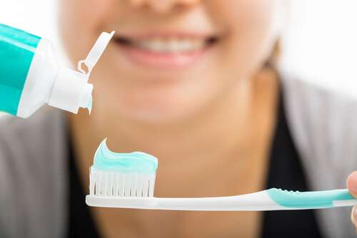
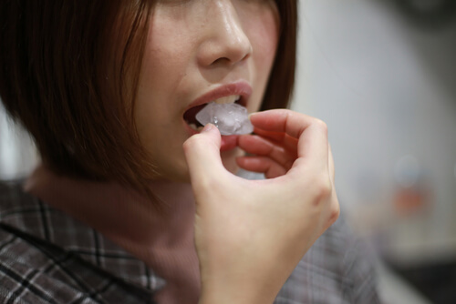

To maintain good oral health, it is essential to brush and floss. However, it is also vital to avoid bad habits that can damage your teeth. A surprising number of people engage in these habitual behaviors almost daily without realizing how harmful they are.

## Brush your teeth after drinking acidic beverages

When you were growing up, you were probably told to brush your teeth after eating and drinking. However, it's essential to wait for [at least 30 minutes](https://www.cuimc.columbia.edu/news/brushing-immediately-after-meals-you-may-want-wait#:~:text=Brushing%20immediately%20after%20consuming%20something,and%20build%20itself%20back%20up.), especially after consuming something acidic.

When you drink an acidic beverage, the acids start to dissolve your tooth enamel. If you brush your teeth immediately, the brush can damage your acid-softened enamel.

Instead, rinse your mouth with water to remove any remaining acid and wait for at least 30 minutes before brushing to allow the enamel to recover from the acid.

Common acidic beverages include:

1. Fruit juices
2. Sodas
3. Sports drinks
4. Coffee
5. Wine
6. Beer

Red wine and coffee are also the two major culprits in discoloring your teeth. Always rinse your mouth with water after drinking staining beverages.

## Chewing ice

 Toothbar- Austin Preventive Dentist

A lot of people think of ice as sugar-free and non-acidic, and it's fun to crunch on it. Unfortunately, [chewing on ice](https://www.webmd.com/oral-health/ss/slideshow-teeth-wreckers) can crack, chip, and even break your teeth.

The cold combined with the pressure can also irritate the tissues inside your teeth, causing toothaches and cold/hot sensitivity.

Habitually chewing on your hard, coarse fingernails can have much the same damaging effect. If you bite your nails and find it impossible to stop, consult your doctor.

This is considered to be an obsessive behavior that may require medication to help you kick the habit.

## Using your teeth as tools

Using your teeth to hold things and tear open packages is a very common human behavior. Scientists have found that ancient humans and [Neanderthals](https://www.pbs.org/wgbh/nova/article/neanderthals-early-modern-humans-teeth-tools/) commonly used their teeth as tools.

They can tell this because using teeth as tools causes severe damage to the teeth, wearing down the enamel and causing cracks, chips, and breaks. Instead of opening things with your teeth, use an actual tool like a pair of scissors.

## Not going to the dentist often enough

Although around one-third of US citizens say they are unhappy with the [appearance of their teeth](https://www.prnewswire.com/news-releases/study-shows-that-one-third-of-american-adults-are-unhappy-with-their-smile-179281261.html), a whopping 36% [visit a dentist](https://www.thehealthyjournal.com/faq/what-percentage-of-people-dont-go-to-the-dentist#:~:text=More%20than%20a%20third%20of,percentage%20jumps%20to%2050%25.)) less than once a year.

[Preventive dentist visits](/austin-preventive-dentist/) are the most important thing you can do to preserve your smile and oral health.

If you fall into the group that engages in one or more of the tooth-damaging practices described above, consider visiting the Toothbar, an Austin dentist near you.

At the Toothbar, you can improve the health of your mouth and get the teeth that you want to show off.

As a premier [Austin cosmetic dentist](/austin-cosmetic-dentist/), the Toothbar has helped many people fix their dental issues and restore their damaged teeth, both cosmetically and functionally.

[Contact us](/contact/) at our Downtown Austin office today. Call: 512-949-8202.
