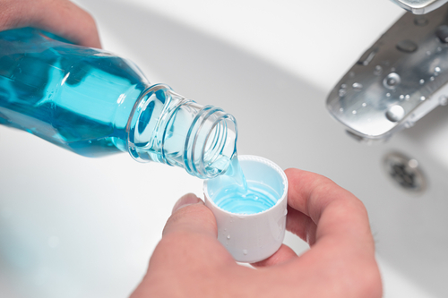

Mouth rinse has the potential to be just as important as brushing when it comes to preventing gum disease and cavities. There are two types of mouthwash, cosmetic, which is meant to make your breath feel fresh, and therapeutic, which helps to prevent tooth decay and gum disease. Both types of [mouthwash have their benefits and drawbacks,](https://www.mouthhealthy.org/all-topics-a-z/mouthwash) but the most important thing to remember is that both types of mouthwash should be used simultaneously to prevent dental problems.

The difference is in the ingredients, which can be a bit complicated at first but generally comes down to science. Cosmetic mouthwash contains abrasives that remove plaque or tartar from between your teeth. These types of products are enriched with preservatives and additives such as ethanol and glycerin that help to keep your breath smelling fresh and clean.

One of the most common myths about mouthwash is that you should use it after brushing your teeth, which is incorrect. The American Dental Association (ADA) states that you should rinse for two minutes with an antibacterial mouthwash after brushing your teeth and before sleeping, eating, or drinking. At Downtown Austin Dental, our dental team provides their patients with many products that contain an antibacterial component. Still, it should be noted that one of these products is high in fluoride and should not be used as a substitute for regular brushing.

## Advantages of Mouthwash

Making your mouth feel fresh is usually one of the main reasons people buy mouthwash, and there are many benefits. Mouthwash can help to improve bad breath. This is an obvious benefit and shouldn't be taken lightly, especially if you know someone who suffers from it. It isn't uncommon to find a mouthwash containing ingredients such as chlorophyllin and zinc gluconate, which have anti-microbial properties and work best to keep your breath smelling fresh.

### 1. Removes Food Debris

The act of rinsing your mouth with mouthwash removes food particles and plaque that are left behind after you brush. This is important because bacteria left on your teeth will thrive on the food particles left behind, eventually leading to tooth decay or gum disease.

### 2. Cavity Protection

Mouthwash not only helps prevent tooth decay and gum disease, but it can also protect teeth suffering from cavities. This is because cavity-causing bacteria will be killed off by mouthwash. However, it's important to note that the bacteria that cause cavities, like Streptococcus mutans, can resist some of these antibacterial agents in the mouthwash. Our experienced cosmetic dentist at Downtown Austin Dental can help you find a product that prevents cavities and decay.

### 3. Reduces Sensitivity

The plaque left behind on your teeth is typically acidic, and this will cause you to feel pain when it builds up. People often develop a sensitivity to their mouth, but applying mouthwash to your teeth can help [prevent the plaque from building up and causing pain](http://knowyourteeth.com/infobites/abc/article/?abc=D&iid=184&aid=3806). The main difference is the ingredients in the product, so make sure you find one that avoids harsh and irritating chemicals.

People often think that mouthwash only helps to improve the smell of your breath, but it provides many more benefits. Not only will it stop food debris from building up, but it will also fight cavities and tooth decay. Are you looking for a competent toothbar near you? [Contact us](/contact/) today for more information on our treatments and our passion for helping you maintain your smile. Call: phone number 512-949-8202 to get your appointment today.
