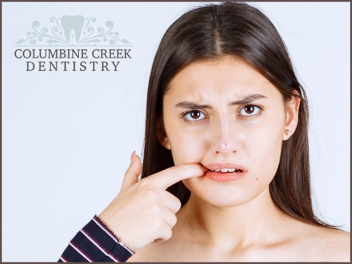

Bleeding gums could be a source of both physical and psychological discomfort. There are various reasons why one may have bleeding gums. It could even be a sign of periodontal disease. It is desirable to give more attention whenever you have bleeding gums rather than ignore them. This blog will discuss various possible causes of bleeding gums. It happens when your gum becomes weak or injured.

## Periodontal Disease

If you suffer from inflammation of the gums, it could signify periodontal disease. It is a bacterial infection that causes bleeding of the gums. Thus, it happens when plaque builds up below the gum line due to a lack of [proper oral hygiene](https://dentistry.uic.edu/news-stories/tips-for-good-oral-hygiene-and-healthy-smiles/), brushing, and flossing which starts irritating and leads to gum disease. Consult a dentist nearby if you think you have gum disease. If you do not get the right treatment at the right time, it may lead to tooth loss.

### Smoking

Those who smoke tend to develop tartar over time in their teeth more than those who do not smoke. Thus the harmful effects of smoking and tobacco make the person prone to gum disease.

[caption id="attachment_3056" align="aligncenter" width="720"] Periodontal Treatment in Littleton CO[/caption]

### Vigorously Brushing or Flossing

You should avoid brushing or flossing hardly since it can damage the sensitive oral tissues that result in the gums bleeding. However, if you see bleeding gums frequently, it is desirable to immediately visit your nearby dentist in Littleton, Colorado. Brush and floss your teeth gently to stay away from bad breath and have a stronger gum.

### Hormones

Tissues of the gum consist of hormone receptors. Enhanced hormone levels can increase the fluids present inside the gum tissue. It results in the gum becoming tender, swollen and red. The symptoms usually go on their own when the hormone levels reduce to normal levels.

### Medications

Consult the dentist or doctor before taking any medications. Some oral contraceptives, nasal sprays etc., are known to cause bleeding gums.

### Deficiency of Vitamin K

Vitamin K has a vital role in blood clotting, and a deficiency of Vitamin K can lead to bleeding gums.

Other causes of bleeding gums could be autoimmune disorders and leukaemia. Bleeding gums are one of the symptoms for those who have leukaemia. Our top-qualified dentist provides the best [bleeding gum treatment in Littleton](/blog/bad-breath-treatments) to maintain your oral health.
