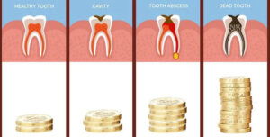

The pain of a toothache can be unbearable, making even the most trivial tasks seem impossible. But despite how tempting it might be to ignore the warning signs and hope for the best, delaying **[emergency dental treatment](/dental-services/emergency-dentistry/)** can have dangerous consequences. In this blog post, we'll explore why getting prompt treatment is crucial when it comes to your oral health and overall well-being. Buckle up as we discuss everything from infections to bone loss that could result from neglecting those painful teeth!

## Synopsis of Common Emergency Dental Cases

There are a number of emergency dental cases that commonly occur. These include:

**Toothaches:** A toothache is typically caused by an infection in the tooth or surrounding gums. This can be extremely painful and should be treated as soon as possible.

**Broken teeth:** A broken tooth can occur due to trauma, decay, or other factors. This can lead to severe pain and infection if not treated promptly.

**Abscesses:** An abscess is a pocket of pus that forms around an infection. If left untreated, it can cause serious health complications.

**Lost fillings:** A lost filling can expose the sensitive inner layers of the tooth to bacteria and food particles, leading to pain and infection.

Delaying treatment for any of these cases can result in serious health complications. It is important to see a dentist as soon as possible if you experience any type of dental emergency.

## Reasons Why People Delay Receiving Treatment

There are many reasons why people delay receiving emergency dental treatment, but the most common reason is fear. Fear of the unknown, fear of pain, and fear of the dentist are all common reasons why people put off receiving dental care.

Other reasons include cost, lack of insurance, and not knowing where to go for treatment. For some people, their teeth are not a priority and they would rather spend their money on other things.

Delaying emergency dental treatment can be dangerous because it can lead to further damage to your teeth and gums. It can also lead to infection and other health complications. If you are experiencing any type of dental pain, it is important to see a dentist as soon as possible.

## How Can Delaying Emergency Dental Treatment Be Dangerous?

Delaying emergency dental treatment can be dangerous because it can lead to more serious problems, such as infection, tooth loss, and damage to the jaw. If you have a dental emergency, it is important to seek treatment right away.

## Effects of Delaying Emergency Dental Treatment

When you delay emergency dental treatment, the problem is likely to get worse. The longer you wait, the more extensive the damage may become. This could lead to even more expensive and extensive treatment down the road. In addition, delaying treatment can also result in pain and suffering. If you’re in pain, it’s hard to concentrate on anything else. This can affect work, school, and your personal life.

## Guidelines for Responding to an Emergency Dental Situation

When you experience a dental emergency, it is important to take quick and appropriate action in order to minimize the risk of further damage or complications. Here are some guidelines for responding to an emergency dental situation:

1. If you have a toothache, rinse your mouth with warm water and use a cold compress to reduce swelling. Take over-the-counter pain medication if needed.
2. If you have knocked out a tooth, try to locate the tooth and gently rinse it off with water (do not scrub it). If possible, try to reinsert the tooth into the socket. If you are unable to do so, place the tooth in a cup of milk or water.
3. If you have cracked or chipped a tooth, rinse your mouth with warm water and use a cold compress to reduce swelling. Take over-the-counter pain medication if needed. You can also cover the broken tooth with sugarless gum or dental adhesive until you can see a dentist.
4. If you have lost a filling or crown, try to locate the restoration and clean it off with water (do not scrub it). You can temporarily replace the filling or crown by using denture adhesive or toothpaste. Be sure to see your dentist as soon as possible so that they can properly reattach the restoration.
5. If you are bleeding from your mouth, apply gentle pressure with a clean cloth to stop the bleeding. Rinse your mouth with warm salt water

## Overview of Follow-Up Care After Treatment

It's no secret that leaving dental problems untreated can lead to bigger, more painful, and more expensive issues down the road. That's why it's so important to follow up with your dentist after treatment, even if everything seems to be going well. Here's an overview of what you can expect during your follow-up appointments.

During your first few follow-up appointments, your dentist will closely monitor your progress and may take X-rays to make sure the problem is resolved. If all is well, you'll likely only need to come in for checkups once or twice a year after that.

If you had more extensive treatment, such as a root canal or tooth extraction, you'll need to take extra care of your teeth and gums at home and return for more frequent checkups. Your dentist will give you specific instructions on how to care for your teeth during this time.

It's also important to keep up with regular brushing and flossing habits and see your dentist for cleanings every six months. Doing so will help ensure that any problems are caught early and treated before they become serious.

Delaying emergency dental treatment can have dangerous consequences, but following up with your dentist after treatment is vital to maintaining good oral health. With proper care, you can avoid further problems down the road and keep your smile healthy and bright.

## Conclusion

It is clear that delaying emergency dental treatment can have potentially dangerous and long-term health consequences. If you are experiencing a serious oral emergency, it’s important to get prompt help from a qualified dentist in order to prevent any further damage to your mouth or the rest of your body. Ignoring the **[signs and symptoms of an oral problem](https://www.aetna.com/health-guide/warning-signs-you-need-to-see-the-dentist.html)** could lead to serious medical complications that can be expensive, time-consuming, and even life-threatening if not addressed quickly by a trained professional.

## FAQs

### Why is it important to seek emergency dental treatment right away?

When you have a dental emergency, every minute counts. The sooner you seek treatment, the more likely you are to save your tooth—or at least minimize damage.

### What are some common dental emergencies?

Some of the most common dental emergencies include toothaches, cracked or chipped teeth, knocked-out teeth, and abscesses. If you're experiencing any of these problems, don't delay in seeking treatment.
