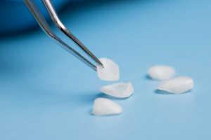

Before you get [veneers](/dental-veneers/) to enhance your smile, it’s important to realize that you won’t be able to have the final restorations placed right away. Typically, you can expect to spend a few weeks wearing temporary veneers while the permanent versions are being made. Why exactly are temporary veneers necessary? And what can you expect when it comes to wearing them? Here’s what you should know before committing to your cosmetic dental treatment.

## What Does the Process of Getting Veneers Look Like?

Getting veneers involves a minimum of two appointments. At your first visit, a small amount of enamel is removed from your teeth before your dentist captures the necessary impressions of your smile. Temporary veneers are then placed on the prepared teeth. Afterward, the impressions are sent to a dental lab to aid with the design and creation of your permanent veneers.

Once your dentist receives the completed restorations, they can schedule your second appointment. During this visit, the temporary veneers are carefully removed from the teeth so that the permanent ones can replace them.

## Why Do You Need to Wear Temporary Veneers?

Removing enamel is an essential part of the veneers process. It helps ensure that there’s enough room to place the final restorations without making your teeth appear too bulky. However, less enamel means that your teeth won’t be as well protected, putting them at a higher risk of being damaged or developing a cavity. As such, placing temporary veneers is necessary to keep your teeth safe until your permanent veneers can be placed.

On top of that, the temporary restorations can give you a preview of what the final veneers will look like once they’ve been attached to your smile. If there’s anything you’re less than satisfied with, you can let your dentist know so that the proper adjustments can be made.

## What Is It Like to Wear Temporary Veneers?

One crucial thing to remember about temporary veneers is that they aren’t as durable as permanent ones. As such, you should plan on making a few adjustments to your diet in order to keep your temporary restorations safe. In particular, you should stay away from hard foods that could damage the veneers or sticky foods that might pull them off the teeth. It’s also a good idea to avoid hot or cold foods, as your teeth will likely be more sensitive than normal for a while after enamel has been removed.

Furthermore, if temporary veneers are placed on multiple teeth in a row, there may not be any gaps between them. As such, you may not be able to floss between the teeth in question during this time. Once you receive your permanent veneers, you should be able to return to your normal flossing routine.

In summary, getting temporary veneers is a necessary step for achieving your goals for your smile. You may have to make a few minor changes to your everyday routine in order to accommodate them, but it will all be worth it once you receive your dazzling permanent veneers.

### About the Practice

At Toothbar, our team of experienced dentists is proud to serve the Austin community with personalized, high-quality dental care in a relaxing environment. We offer a wide range of cosmetic dental treatments, including veneers, so that we can help all of our patients achieve smiles that they love. If you are interested in getting veneers to correct the imperfections on your teeth, you can schedule an appointment by visiting our [website](/contact/), using our [online booking tool](https://schedule.jarvisanalytics.com/frame/toothbar?location_id=7180&lnsg=lnsg_5924029d-cc38-4216-b401-4afd935acd86), or calling us at (512) 607-4268.
